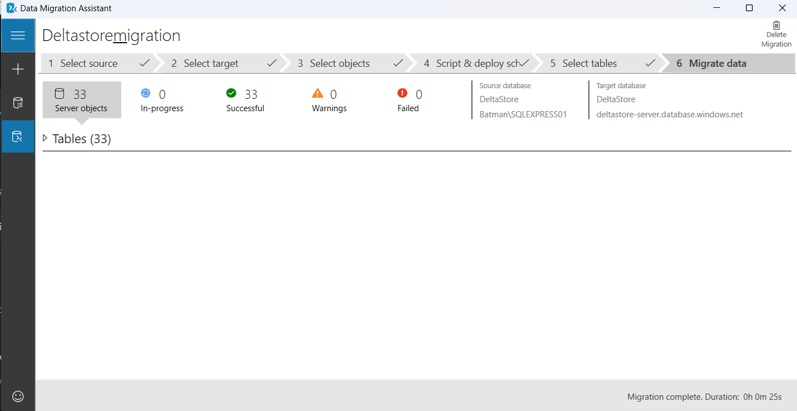

# E-Commerce Data Pipeline & Analytics Project

## Overview
This project is an end-to-end data pipeline designed to extract, transform, and analyze e-commerce data from multiple sources. The pipeline integrates data from a **new e-commerce store** (via API) and an **old store's database**, processes it using **dbt**, and loads the final marts into **Azure SQL** for better performance. Automated **CI/CD** workflows ensure quality and reliability in the transformation process, and final insights are visualized through **Tableau dashboards**.

### Project Workflow (Overview Piepline)

## Directory Structure & Purpose
Each folder in the directory serves a specific purpose in the data pipeline. Detailed documentation is available within each folder.

### 1. **extract_data_export_marts**
   - Extracts raw data from the new store via API.
   - Loads extracted data into the **DeltaStore** database.
   
### 2. **deltastore_dbt_transformation**
   - Transforms raw data from both the old and new stores.
   - Creates **final marts** using dbt.
   - Includes **staging, intermediate, and fact layers**.

### 3. **database_migration_to_azure_sql**
   - Migrates the database from **SQL Server** to **Azure SQL** for better scalability and performance.
   
   

### 4. **ci_cd_pipeline**
   - Implements **CI/CD with GitHub Actions**:
     - Runs tests on **every pull request**.
     - Executes **state-modified+ runs** to optimize dbt transformations.

### 5. **dbt_airflow_automation**
   - Uses **Docker** to build a **custom dbt-Airflow image**.
   - Deploys **Airflow DAGs** to automate the dbt build process in the **PROD environment**, scheduled for **2 AM daily**.
    

### 6. **UML_modelisation_overview**
   - Provides a UML model of the final marts before reporting.

   

### 7. **deltastore_tableau_dashboard**
   - Uses **final marts** to create **three Tableau dashboards**:
     - **Customer Analysis**
     - **Product & Pricing Optimization**
     - **Order Fulfillment & Logistics**
   
   

   
   
   

---

## Detailed Documentation
Each folder contains a dedicated README file explaining its purpose, structure, and implementation details. Refer to those for more in-depth information on specific components.

---

This project demonstrates an end-to-end **modern data stack** with **automated workflows** for a scalable, efficient, and insightful data analytics pipeline!

