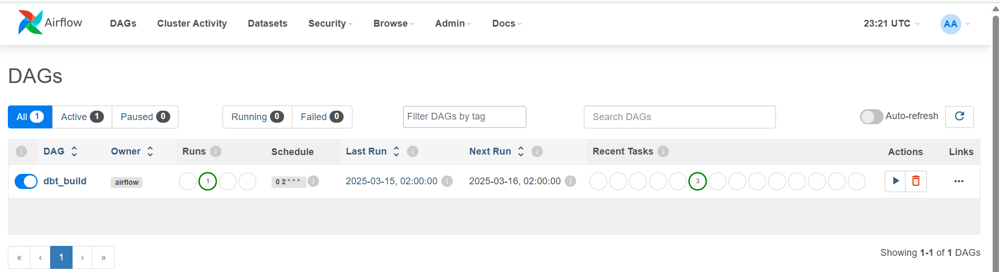
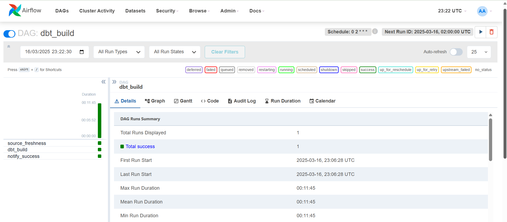

# deltastore_airflow

## Project Overview
The `deltastore_airflow` folder contains the infrastructure and DAGs required to orchestrate data transformations in the **PROD** environment using **Apache Airflow** within a **Dockerized environment**. This setup ensures efficient and automated execution of `dbt` transformations for the `deltastore` project, running on a scheduled basis.

## Architecture
The Airflow instance runs inside a **Docker container** with the following key components:
- **DAGs**: Define the workflow of tasks to be executed.
- **Dockerfile**: Defines the custom Airflow image with all necessary dependencies.
- **Docker Compose**: Configures Airflow services and mounts required directories.
- **DBT Integration**: Uses Airflow to orchestrate `dbt` transformations inside the container.

## Docker Setup
The `docker-compose.yml` file defines the services and their configurations, including **volumes** for persistence.

### Mounted Volumes
These volumes ensure that Airflow can access the necessary files and configurations:
```yaml
volumes:
  - ./dags:/opt/airflow/dags           # DAGs folder
  - ./logs:/opt/airflow/logs           # Logs for tracking execution
  - ./plugins:/opt/airflow/plugins     # Plugins directory
  - ./deltastore_dbt_transformation/profiles.yml:/opt/airflow/.dbt/  # DBT profile for connection
  - ./deltastore_dbt_transformation:/opt/dbt  # DBT project folder
  - ./config/airflow.cfg:/opt/airflow/config/airflow.cfg  # Custom Airflow configuration
```

## Custom Airflow Image (Dockerfile)
A custom Airflow image 'dbt-airflow' is created with the required **system dependencies** and **Python packages**, including support for **SQL Server** and `dbt`.

### Key Features:
- Installs necessary Linux packages (`unixodbc`, `msodbcsql17`, `git`, etc.).
- Installs **dbt-core** and **dbt-sqlserver** for running `dbt` inside Airflow.
- Includes Microsoft SQL Server drivers for database connectivity.
- Upgrades the Airflow database on startup.

```dockerfile
FROM apache/airflow:2.9.0

# Switch to root user to install system dependencies
USER root

# Install required system packages for SQL Server, and dependencies
RUN apt-get update && \
    apt-get install -y \
    git \
    curl \
    unixodbc \
    unixodbc-dev \
    odbcinst \
    gnupg2 \
    python3-pip \
    libffi-dev \
    build-essential \
    libssl-dev \
    libmysqlclient-dev \
    python3-dev \
    && curl https://packages.microsoft.com/keys/microsoft.asc | apt-key add - \
    && curl https://packages.microsoft.com/config/debian/10/prod.list > /etc/apt/sources.list.d/mssql-release.list \
    && apt-get update \
    && ACCEPT_EULA=Y apt-get install -y msodbcsql17

# Install Python dependencies
USER airflow
RUN pip install --no-cache-dir \
    dbt-core==1.8.7 \
    dbt-sqlserver \
    apache-airflow-providers-microsoft-mssql \
    apache-airflow-providers-odbc \
    pyodbc \
    airflow-provider-great-expectations \
    azure-batch \
    azure-mgmt-datafactory \
    azure-synapse-artifacts

# Ensure Airflow database is up to date
RUN airflow db upgrade

# Switch back to airflow user
USER airflow
```

## DAG: `dbt_build.py`
This DAG automates the execution of `dbt` transformations and ensures that the source data is fresh before running transformations.

### DAG Components:
1. **`source_freshness`**: Runs `dbt source freshness` to verify data freshness.
2. **`dbt_build`**: Executes `dbt build` to transform and load data.
3. **`notify_success`**: Prints a success message upon completion.

### DAG Code:
```python
from airflow import DAG
from airflow.operators.bash import BashOperator
from airflow.utils.dates import days_ago

default_args = {
    "owner": "airflow",
    "start_date": days_ago(1),
    "retries": 3
}

with DAG(
    "dbt_build",
    default_args=default_args,
    schedule_interval="0 2 * * *",  # Runs every day at 2 AM
    catchup=False,
) as dag:

    source_freshness = BashOperator(
        task_id="source_freshness",
        bash_command="cd /opt/dbt && dbt source freshness",
    )
    
    dbt_build = BashOperator(
        task_id="dbt_build",
        bash_command="cd /opt/dbt && dbt build --target prod",
    )

    notify_success = BashOperator(
        task_id="notify_success",
        bash_command="echo 'job completed successfully!'"
    )

    source_freshness >> dbt_build >> notify_success
```

## Execution Flow
1. **Airflow triggers the DAG on schedule** (daily at 2 AM).
2. **`dbt source freshness` runs** to verify if source data is fresh.
3. **`dbt build` executes** all models (staging, intermediate, marts, etc.).
4. **A success notification is logged** once the job completes.

## Screeshots



## Summary
This Airflow setup ensures automated, reliable execution of data transformations in `dbt` PROD environment, using a Dockerized environment with proper dependency management and scheduling. The system is scalable and can be extended to handle more complex workflows in the future.

